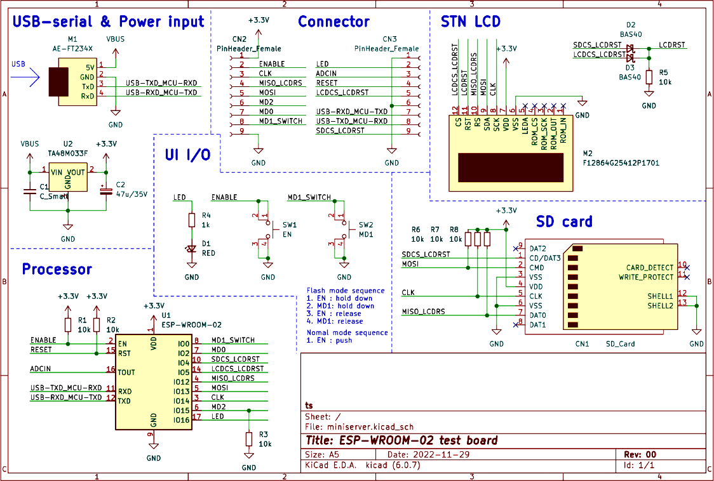

Esp8266Test
====================

## 概要

ESP-WROOM-02を使用した自作テストボード用のテストプログラム。  
最終的に気温センサー出力値を一定間隔で記録するデータロガーを作成したい。

* LCDに状態を表示
* データ、設定はSDカードに保存
* webページでログ値をグラフ表示(可能か不明)
* webページで各種設定などを行う(可能か不明)

## 使い方

1. `reference/sdcard`の中身をSDカードのルートにコピー
2. テストボードのSDソケットにSDカードを挿入
3. `make menuconfig`のメニュー内Serial `flasher config` > `Default serial port`でシリアルポートを設定
4. テストボードのスイッチをReset押し込む > IO0押し込む > Reset離す > IO0離す の順で操作する
5. `make flash monitor`でコンパイル、書き込み、シリアルモニタ起動を行う
6. Resetを押す

**註:**

* SDカードは電源投入前から挿入されている前提で、動作中に挿入しても初期化を行わない
* リセットする場合はリセット前にSDカードを一旦抜く  
  抜かないとマウント済みフラグがリセットされ再度マウント処理を行ってしまい、エラーとなる

## テストボード回路図

## ESP-WROOM-02接続

| Pin | Name | Function           | Net             | Remarks                      |
|-----|------|--------------------|-----------------|------------------------------|
|  1  | 3V3  | _(power)_          | 3.3V            | -                            |
|  2  | EN   | _(fix)_            | ENABLE          | -                            |
|  3  | IO14 | HSPI_CLK / I2C_SCL | CLK             | SD clk / LCD clk             |
|  4  | IO12 | HSPI_MISO          | MISO_LCDRS      | SD out / LCD rs              |
|  5  | IO13 | HSPI_MOSI          | MOSI            | SD in / LCD in               |
|  6  | IO15 | PWM_G              | MD2             | Boot(L) /                    |
|  7  | IO2  | I2C_SDA            | MD0             | Boot(H) /                    |
|  8  | IO0  |                    | MD1_SWITCH      | Boot(H:run,L:flash) / Switch |
|  9  | GND  | _(power)_          | DGND            | -                            |
| 10  | IO4  |                    | SDCS_LCDRST     | SD cs / LCD rst(*1)          |
| 11  | RXD  | UART0_RXD          | USB-TXD_MCU-RXD | Flash / Debug                |
| 12  | TXD  | UART0_TXD          | USB-RDX_MCU-TXD | Flash / Debug                |
| 13  | GND  | _(power)_          | DGND            | -                            |
| 14  | IO5  |                    | LCDCS_LCDRST    | LCD cs / LCD rst(*1)         |
| 15  | RST  | _(fix)_            | RESET           | -                            |
| 16  | TOUT | ADC                | ADCIN           | ?                            |
| 17  | IO16 | (WAKEUP)           | LED             | LED (H=on)                   |
| 18  | GND  | _(power)_          | DGND            | -                            |

**註:**

* (*1) IO5,IO4が同時にLの時、LCD resetがLになる
* ESP8266起動時、Flashモードに入るためにGPIO15をLowに保つ必要がある。
